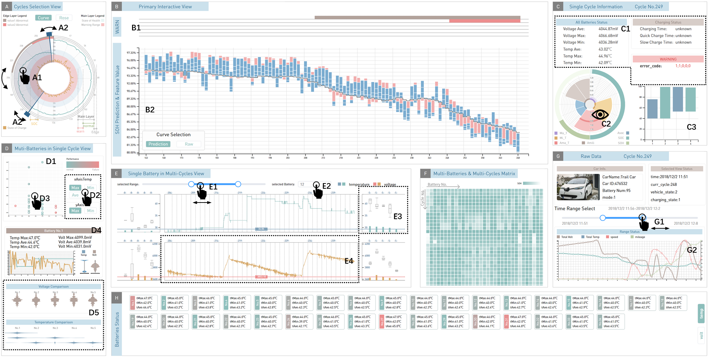
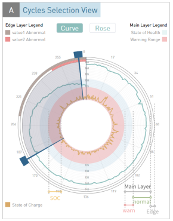
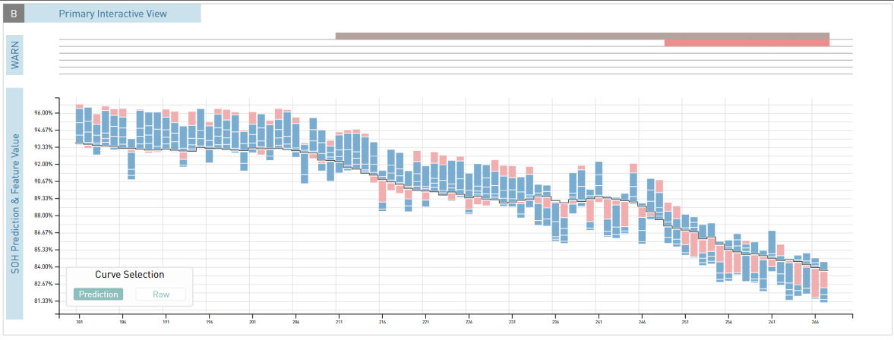
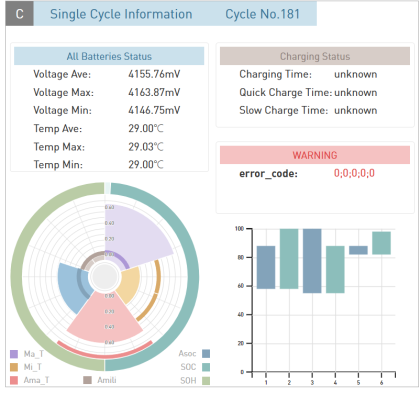
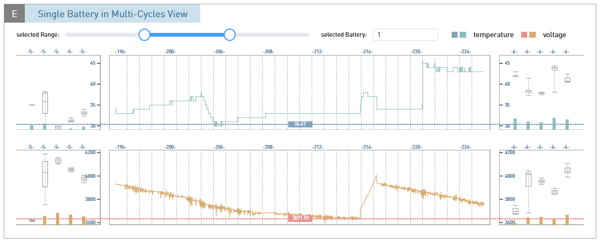
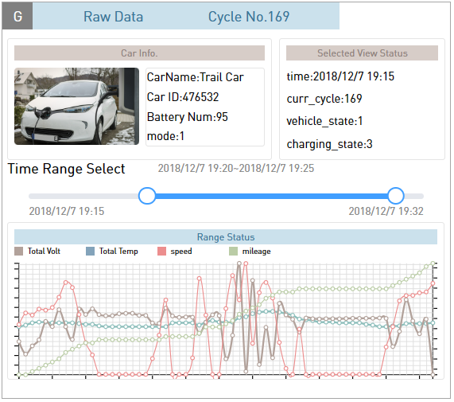
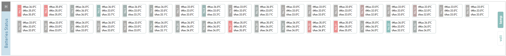
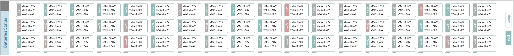

# Introduction of BatteryLens Software

## Brief Introduction

The system focuses on the practical application scenarios of batteries, aiming to identify external factors that cause battery anomalies rather than repairing of direct damage causes. Many unexpected influences occur in real usage, such as external temperature, user's unreasonable driving and charging habits, and possibly more. But our dataset only includes these few items currently. We quantify these factors as features and then use the Ampere-hour integration method to estimate State of Health (SOH) and use the features as inputs to predict SOH. The purpose of the process is to use the interpretable algorithm SHAP to obtain the contribution of each feature in the results.

 

We suggest that it is difficult to detect what features have abnormal effects on SOH only based on raw data. Therefore, we can only extract the relationship of feature contributions from the predictive model and reflect the feature abnormalities through the abnormality of feature contributions. The main approach is to compare the contribution of a cyclic period with the average contribution over a previous period. We have developed this comparative analysis process into a visual analysis view.

 

After identifying the location and type of exception, the remaining views provide access to various data and analyze battery’s consistency. We believe that battery inconsistency and anomalies are closely related. Through comprehensive analysis, we hope that users can analyze the battery's deficiency in certain external conditions and help improve it.

 

How to identify anomalies: ① Alarms ② Changes in the slope of the SOH curve ③ Changes in the arrangement of feature contributions

 

How to investigate the cause of anomalies: ① Examine the specific distribution of contributions and compare them over time ② Check the battery group view and compare battery data over time ③ View more data for auxiliary analysis

 

In the visual analysis interface, we have designed multiple visual analysis views, including an overview view(Cycles Selected View), long-term status view(Primary Interactive View), single-cycle view(Single Cycle Information View), and battery group view(rest views). Users can determine the occurrence of abnormal charge-discharge cycles through the Cycles Selected View and Primary Interactive View, and then in the Single Cycle Information View, we have designed a multi-ring fan-shaped comparison view, which intuitively reflects the difference between the current contribution and historical statistical patterns, thereby determining abnormal data. In the other views, analysis of individual battery anomalies and visualization of raw data are provided. The following are the specific functions of each view.

## **A.** **Cycles Selected View**

This view allows you to view the overall trend and distribution of battery data throughout the process and narrow down the scope to analyze specific regions of interest. The outermost layer of the view is the edge layer, divided into two circular regions. Different abnormal information of the battery is displayed in different layers. The outer alarm circular ring represents the abnormal state of the battery's raw data, while the inner alarm circular ring represents the abnormal state of SOH. The main layer within the edge layer is divided into normal and warning regions. The green line represents the predicted SOH state of the battery, displaying the data throughout all cycles. In the main layer, a light blue circular ring is added to indicate the warning region of SOH, and the threshold for warnings can be set by the user. In the innermost part of the entire view, the SOC display layer is filled with pink background, and the yellow line represents the average SOC value of all batteries at the end of the current cycle.

## **B.** **Primary Interactive View**

This is the main component of the system, displaying the SOH (State of Health) changes and feature contributions over cycles. This view is divided into two parts, with the alarm layer on top and SOH prediction and feature contribution display below. Both parts share the same horizontal axis, representing the number of battery charge-discharge cycles. When a user is interested in a specific cycle, clicking on a particular area in the view triggers responsive changes in the Single Cycle Information View and other relevant views, allowing users to quickly access information.

## **C.** **Single Cycle Information View**

This view is divided into two main parts: the information is displayed on the top and the views are on the bottom. The information display consists of three columns that primarily present the status of all batteries, charging information, and native warning codes within the current cycle.

The left semicircular ring represents the remaining SOH of the current charge-discharge cycle, while the right semicircular ring represents the SOC (State of Charge) of the current cycle. Inside the two semicircular rings is a rose plot. Each color represents a specific feature, with the radius indicating the absolute magnitude of the feature's contribution in the current cycle. A white line in the middle represents a negative contribution of the corresponding feature. On the left side, there is a bar graph showing the variation of SOC. In this view, the horizontal axis represents the charge-discharge cycles within the current cycle, while the vertical axis represents the SOC percentage. The rectangles have two colors: blue represents the charging cycle, where the bottom of the rectangle represents the battery's remaining capacity at the start of the cycle, and the top represents the capacity at the end of the cycle. Green represents the discharging cycle, where the top and bottom of the rectangle correspond to SOC and the opposite of the charging cycle.

## **D.** **Muti-Batteries in Single Cycle View**

|  |  |  |
| ------------------------------------------------------------ | ------------------------------------------------------------ | ------------------------------------------------------------ |
|                                                              |                                                              |                                                              |

 

This view primarily consists of four subviews. Each point in the scatter plot at the top of the main view represents a different battery within the selected cycle, and the color of the scatter points represents the status of the corresponding battery in the current cycle based on the intermediate numbering. We provide options for the user to choose the types of coordinate axes on the side: the horizontal axis can be selected as the maximum temperature, average temperature, or minimum temperature of the batteries, and the vertical axis can be chosen as the maximum voltage or minimum voltage of the batteries. We have added interactive options to each scatter point, so when a user clicks on a particular point, the lower part of this view, the Single Battery Display View, will show the corresponding battery's data. In a specific cycle, this view depicts the voltage and temperature profiles of the corresponding battery through line plots and violin plots, enabling users to analyze the distribution of voltage and temperature among all batteries within the same cycle.

## **E.** **Single Battery in Multi-Cycles View**

At the top of this view, there is an interactive panel when users input different battery numbers, the corresponding data changes will be displayed below. Selecting different regions will also show the corresponding data changes. This view consists of two layers, representing the voltage and temperature profiles respectively. Each layer is divided into the margin regions on the left and right sides and the main region in the middle. In the main region, to facilitate users in identifying the corresponding cycle period for each line segment, the current cycle number is labeled above each line segment. In the margin regions, we depict five sets of box plot to describe the data states before and after several cycles in the main view. The margin regions and the middle region share the same y-axis.

## **F.** Multi-Batteries & Multi-Cycles Matrix

![image-20240416234330816]./pic/image-20240416234330816.png)

Each small rectangle represents a battery in some cycle. The entire matrix uses the battery numbers as the horizontal axis and the cycle count as the vertical axis. The color of each small rectangle ranges from dark to light, representing the status of the batteries.

 

## **G.** **Raw Data View**

In this area, basic data of electric vehicles is displayed, such as vehicle name, ID, number of battery packs, and vehicle mode. It also includes information about the start time of the current cycle, selected cycle, vehicle status, and charging status. A range selector is used to choose the data range to display. The start time and end time of the current cycle are added on both sides of the selector, and the selected time range for observing data is labeled above it.

## **H.** **Batteries Status View**

All the batteries within the selected cycle are arranged in this view. The background color of each probe (battery) title represents the performance status of the batteries near the probe. By default, each information box displays three rows of data: average temperature, highest temperature, and lowest temperature detected by the probe. Users can switch to displaying average voltage, highest voltage, and lowest voltage of the batteries by using the buttons on the right side. 

